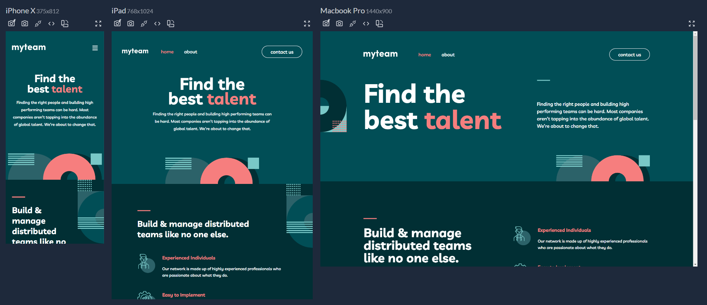

# FIND THE BEST TALENT

Find the best talent is a responsive web application built with React, React Router, and Tailwind CSS, inspired by a Figma design layout provided by FrontendMentor.

## Features:

- Responsive design for various screen sizes.
- Interactive web application using React.
- Utilizes React Router for seamless navigation between pages.
- Stylish and maintainable UI with Tailwind CSS.

### FrontendMentor Challenge:

[https://www.frontendmentor.io/challenges/myteam-multipage-website-mxlEauvW](https://www.frontendmentor.io/challenges/myteam-multipage-website-mxlEauvW)

### Demo:

[https://find-the-best-talent.vercel.app/](https://find-the-best-talent.vercel.app/)

### FrontendMentor Profile:

[https://www.frontendmentor.io/profile/Ronaldodev03](https://www.frontendmentor.io/profile/Ronaldodev03)
